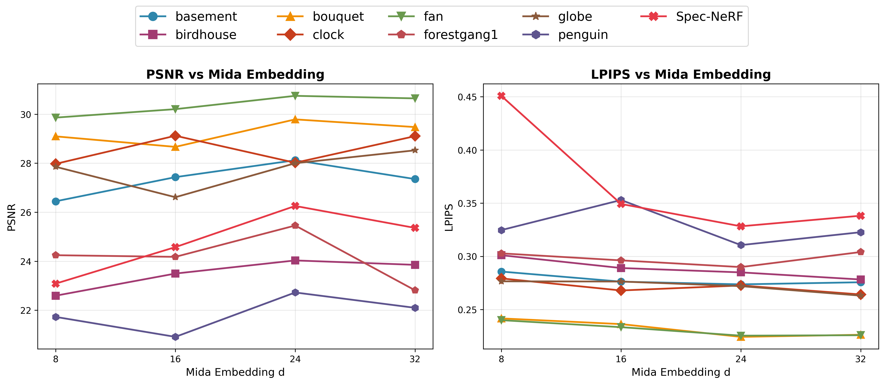

# 3D Gaussian Splatting per a dades multiespectrals

Aquesta implementació està basada en el repositori de [**Gaussian Grouping**](https://github.com/lkeab/gaussian-grouping) i amplia el model de [**3D Gaussian Splatting (3DGS)**](https://github.com/graphdeco-inria/gaussian-splatting) perquè pugui operar eficientment amb dades **multiespectrals i hiperespectrals**.  
L'objectiu principal és millorar la qualitat de reconstrucció i el valor semàntic de les escenes generades, permetent extreure informació sobre els materials presents.

## Índex

- [Extensió principal](#extensió-principal)
- [Estructura del projecte](#estructura-del-projecte)
- [Datasets](#datasets)
- [Entrenament](#entrenament)
- [Avaluació](#avaluació)
- [Experiments i Resultats](#experiments-i-resultats)

---

## Extensió principal  
- Cada gaussiana aprèn un **embedding espectral latent** en lloc de només un color RGB.  
- Aquest embedding és processat per un **MLP** per predir múltiples bandes espectrals.  
- Permet una representació compacta, eficient i apta per tasques posteriors com segmentació semàntica o classificació de materials.

---

## Estructura del projecte

```
hyper-gaussian-grouping-tfg/
  arguments/ Definició de paràmetres d'entrenament per optimització i del model.
  config/ Conté paràmetres d'entrenament.
  data/ Carpeta on s'ubiquen els datasets, conté codi per preparar-los.
  docs/ Documentació d'instal·lació.
  gaussian_renderer/ Codi relacionat amb la representació 3D de les gaussianes i renderitzat diferencial.
  media/ Imatges i resultats de mostra.
  scene/ Fitxers i utilitats per fer servir escenes 3D, configuració de càmeres, dades d'entrenament, etc.
  submodules/ Conté codi CUDA per a la rasterització de les gaussianes.
  utils/ Funcions comunes reutilitzades en diverses parts del codi.
  *.py Scripts python
```

### Scripts de nivell arrel

- ```avaluacio.py```: Codi per avaluar els models entrenats. Serveix per mostrar imatges comparatives de groundtruth, train i test; mesurar mètriques (PSNR, SSIM i LPIPS) i mostrar gràfiques.
- ```convert.py```: S'utilitza per executar el COLMAP amb els arguments necessaris per deixar els datasets llestos per l'entrenament.
- ```get_data.py```: Script auxiliar molt senzill per mostrar els punts inicials i gaussianes que conté un point_cloud.ply.
- ```hyper.py```: Conté les definicions dels models utilitzats (MLP, Conv) per predir el color a partir dels embeddings renderitzats i una funció per calcular una part de la Loss (L1).
- ```hyper.sh```: Script bash que s'encarrega d'executar els scripts importants del projecte per generar el núvol de punts inicial i les poses de les càmeres, entrenar i renderitzar.
- ```hyper_render.py```: Conté el codi per carregar una iteració del model i poder renderitzar les imatges de test.
- ```hyper_train.py```: Codi per l'entrenament del model.
- ```metrics.py```: Mètriques per avaluar els resultats.
- ```reshape.py```: Script auxiliar per redimensionar imatges.

---

## Datasets

Per preparar els datasets, aquests s'han de situar en la carpeta ```data/``` i han de contenir el format:
```
data/
  nom_del_dataset/
    channels_distorted/
      0/
      1/
      ...
      n_canals-1/
    input/
```

La carpeta channels_distorted/ ha de contenir les imatges separades per canals i la carpeta input/ ha de contenir imatges per poder executar el COLMAP, aquestes es poden formar amb un rgb artificial juntant 3 canals o es pot agafar un dels canals.

La carpeta ```data/``` ja conté carpetes dels datasets utilitzats en aquest treball amb els scripts per poder preparar-los.

### Per preparar els datasets utilitzats

- **MultimodalStudio**: Consta de 32 escenes amb 50 imatges i 9 canals cadascuna. Aquest es pot descarregar en la seva pàgina en el següent enllaç: https://lttm.github.io/MultimodalStudio/pages/dataset.html.

  Hi ha dues opcions, descarregar únicament l'escena Birdhouse (6 GB) o descarregar el dataset complet (128 GB). En qualsevol dels 2 casos, la carpeta descarregada s'ha de situar en la carpeta ```data/multi-modal-studio/```. Allà hi ha un script ```mms.py``` per preparar el datatset. Només s'han de modificar les variables ```path_input``` i ```path_output``` en funció de l'escena que s'utilitza. De manera predeterminada està posada l'escena Birdhouse.

  Llavors s'excuta: ``` python mms.py ```

- **Basement**: Consta d'una escena de 50 imatges i 9 canals cadascuna. Aquest dataset ha estat proveït per Arnau Marcos Almansa.

  Per preparar-lo s'ha de posar dins de la carpeta ```data/basement``` i llavors executar ``` python basememt.py ```.

  Si les imatges són molt grans, es pot aprofitar per fer el COLMAP, però després per l'entrenament potser que no hi càpiguen en la GPU. Llavors es pot executar ``` python reshape.py ```.
  Al final d'aquest script es pot canviar la variable ```route``` per incloure el path de les imatges que es volen redimensionar. En aquest cas: ```data/basement/images```.

- **X-NeRF**: Consta d'una escena de 30 imatges i 10 canals cadascuna. Aquest es pot descarregar en el següent enllaç: https://amsacta.unibo.it/id/eprint/7142/.

  Un cop descarregat, s'ha de crear la carpeta ```penguin/``` i ubicar-la a ```data/xnerf```. Dins de ```penguin/``` s'ha de co·locar l'arxiu descarregat ```ms_imgs.npy``` i llavors executar ``` python xnerf.py ```.

- **Spec-NeRF**: Consta d'una escena de 9 imatges i 20 canals cadascuna. Es pot descarregar des del seu github: https://github.com/CPREgroup/SpecNeRF-v2?tab=readme-ov-file.

  Es decarrega una carpeta anomenada ```RAW/``` que s'ha de situar dins de ```data/Spec-NeRF``` i executar el script ``` python spec-nerf.py ```.

Taula resum de les escenes utilitzades i petita descripció:

| Dataset                   | Imatges | Canals | Descripció |
|----------------------------|---------|--------|------------|
| MultimodalStudio - Birdhouse | 50      | 9      | Caseta d’ocells amb il·luminació halògena |
| Basement                    | 50      | 9      | Escena amb fruites i MacBeth Colorchecker |
| X-NeRF - Penguin            | 30      | 10     | Pingüins sobre cadira, sensors multimodals |
| Spec-NeRF                   | 9       | 20     | Doraemon i MacBeth Colorchecker, dades reals i sintètiques |

---

## COLMAP

Abans d'inicialitzar l'entrenament del model per un dataset concret, s'ha de generar: 
- Un núvol de punts inicials que serviran com a centre de les gaussianes.
- Les poses de les càmeres.
- Les imatges desdistorsionades.

De tot això s'encarrega el script convert.py que executa el COLMAP amb els arguments corresponents.

Per executar-lo es pot fer ús del script bash ```hyper.sh```. Aquest conté diferents variables que s'han de modificar segons el dataset a utilitzar i configuracions destijades:
- ```SOURCE_PATH```: Ubicació del datatset.
- ```DATASET_NAME```: Nom del dataset.
- ```NUM_CHANNELS```: El número de canals que contenen les imatges del dataset.
- ```CONVERT```: Booleà que si s'estableix a ```true``` es crida a ```convert.py```.

Per executar el COLMAP llavors s'ha de fer la següent comanda establint ```CONVERT=true```:

``` 
bash hyper.sh
```

Això generarà les carpetes:
- ```channels_undistorted/```: Les imatges desdistorsionades per canal en ```.png```.
- ```images/```: Les imatges desdistorsionades de la carpeta ```input/```.
- ```sparse/```: Infomació necessària per inicialitzar les gaussianes (núvols de punts, poses de càmeres,...).

---

## Entrenament

Una vegada el dataset està completament preparat, es pot iniciar l'entrenament. Això es fa amb el script ```hyper_train.py```.

Aquest implementa el procés d’entrenament del model de 3D Gaussian Splatting estès per a dades multiespectrals. A partir d’un conjunt de càmeres d’entrenament, el pipeline renderitza vistes sintètiques utilitzant gaussianes 3D i obté embeddings espectrals latents per píxel, que són processats per un model neuronal (MLP o convolucional) per predir les diferents bandes espectrals. L’entrenament s’optimitza mitjançant una funció de pèrdua basada en una combinació de L1 i SSIM multiespectral.

El script inclou mecanismes de densificació i poda dinàmica de gaussianes, validació periòdica sobre vistes de test i guardat de checkpoints i resultats intermedis. La configuració del model, del pipeline i dels paràmetres d’optimització es gestiona mitjançant arguments i fitxers JSON, permetent una experimentació flexible. Tot i això, hi ha paràmetres que es poden modificar directament des de ```arguments/__init__.py``` per modificar l'optimització de les gaussianes o des de ```hyper.py``` si es vol modificar el model neuronal.

Durant l’entrenament, també es generen prediccions espectrals que poden ser utilitzades posteriorment per avaluació quantitativa o tasques semàntiques.

Abans d'inciar el train, hem de tenir en compta les variables que es poden modificar de ```hyper.sh```:
- ```TRAIN```: Booleà que si s'estableix a ```true``` es crida a ```hyper_train.py```.
- ```MAX_ITERS```: Iteracions que farà el bucle d'entrenament.
- ```EXPERIMENT```: Nom que se li pot donar a un conjunt de paràmetres establerts per un dataset.
- ```GPU```: En cas de voler executar entrenaments en paral·lel es pot canviar aquest valor si es disposa de més d'una gràfica.
- ```ITERS```: Iteracions en les quals es guardarà un checkpoint del model, imatges de train/test i arxius ```.ply``` amb el núvol de punts.
- ```DIM_EMBEDDING```: Dimensió que s'assigna a l'embedding que conté cada gaussiana. També s'ha de modificar en:
    - ```submodules/diff-gaussian-rasterization/cuda_rasterizer/config.h```
    - ```arguments/__init__.py```
    - ```scene/gaussian_model.py```

Per iniciar l'entrenament s'ha de fer la següent comanda establint ```TRAIN=true```:

``` 
bash hyper.sh
```

Això generarà en ```output/``` una carpeta amb el nom ```(DATASET_NAME)_(EXPERIMENT)``` amb els resultats de l'entrenament.

---

## Avaluació

Per avaluar un model entrenat hi ha dues opcions:
- ```hyper_render.py```: S’encarrega de la fase de renderització i visualització dels resultats d’un model entrenat. A partir d’una iteració guardada, el script carrega les gaussianes 3D i el model neuronal associat, renderitza les vistes de les càmeres d’entrenament i test, i genera prediccions espectrals a partir dels embeddings latents obtinguts durant el renderitzat. Les sortides es guarden de forma organitzada, permetent la comparació directa amb les imatges ground truth.

  Per fer el render hem de tenir en compte aquests paràmetres de ```hyper.sh```:
  - ```RENDER```: Booleà que si s'estableix a ```true``` es crida a ```hyper_render.py```.
  - ```MAX_ITERS```: Conté la iteració que es renderitzarà.
  - ```METHOD_DIM_REDUCTION: Pot ser "t-sne" o "pca" si es vol visualitzar l'embedding, però també es pot fercarregant el ```point_cloud``` en un visualitzador.
  - ```NUM_FRAMES```: Nombre de frames que es volen renderitzar, es pot augmentar si hi ha prous càmeres de test.

  Per fer el render s'ha de fer la següent comanda establint ```RENDER=true```:

  ``` 
  bash hyper.sh
  ```
  
- ```avaluacio.py```: Aquest script s’encarrega d’avaluar quantitativament i visualment els resultats d’un experiment comparant les prediccions del model amb el ground truth. Carrega les sortides generades (en format ```.npy```) per a diferents datasets, experiments i mides d’embedding, i calcula mètriques estàndard de qualitat d’imatge com PSNR, SSIM i LPIPS per als frames de test (i opcionalment de train), canal a canal. A més, permet comparar múltiples experiments (per exemple, diferents dimensions d’embedding) mitjançant gràfiques i genera visualitzacions qualitatives guardant imatges de predicció i ground truth per a un canal concret, facilitant així tant l’anàlisi numèrica com la inspecció visual dels resultats.

  Cadascuna d'aquestes funcionalitats es pot utilitzar canviant la el booleà ```True```/```False``` a l'inici del bloc. En el script està comentada la funcionalitat de cada bloc.

  Per executar-lo hem de tenir en compte les seguüents variables:
  - ```dataset_solo``` i ```experiment```: Per calcular mètriques o visualització test/train per un dataset i experiment concrets.
  - ```experiments```: Per calcular mètriques per un conjunt d'experiments o visualitzar una gràfica.
  - ```iter```: Iteració a avaluar.
  - ```channel```: Canal a avaluar. En el codi està comentat els rangs vàlids pels datasets utilitzats.
  - ```datasets_config```: Diccionari que conté per cada nom de dataset en la carpeta output:
    - Frames de test
    - Frames de train
    - Path del dataset en la carpeta ```data/```.

  Per executar-lo s'ha de fer la comanda:

  ```
  python -i avaluacio.py
  ```

---

## Experiments i Resultats

- Optimitzador: **Adam**, ```learning rate```: 0.0001, ```densify_grad_threshold```: 0.0002
- Iteracions: 30.000 
- Estratègia de densificació: cada 100 iteracions, des de la iteració 500 fins a la iteració 15000   

### Models comparats

| Experiment | Model | Depth | Dim. Hidden |
|------------|-------|-------|-------------|
| Ex1        | MLP   | 3     | dim_in      |
| Ex2        | Conv  | 3     | dim_in      |
| Ex3        | MLP   | 10    | dim_in      |
| Ex4        | MLP   | 1     | dim_in      |
| Ex5        | MLP   | 3     | 10*dim_in   |
| Ex6        | Conv  | 3     | 10*dim_in   |

### Resultats quantitatius

| Dataset / Exp | PSNR ↑ | SSIM ↑ | LPIPS ↓ |
|---------------|--------|--------|---------|
| Birdhouse Ex5 | 23.61  | 0.847  | 0.296   |
| Basement Ex5  | 27.02  | 0.897  | 0.358   |
| Penguin Ex3   | 24.97  | 0.852  | 0.287   |
| Spec-NeRF Ex3 | 26.38  | 0.873  | 0.344   |

> Millors resultats destacats per dataset. La taula completa es troba en l'article.

### Influència de la mida de l'embedding

- Configuració de l'experiment 5
- Iteracions: 70.000
- Embeddings: `d = 8, 16, 24, 32` (millor resultats amb 24).

>

### Resultats qualitatius

- Les reconstruccions són **coherents amb l’estructura global** de les escenes.  
- Limitacions observades: fons difusos, textures especulars i zones amb poques vistes.  

> 
> *Comparació entre imatge de groundtruth i predicció*
